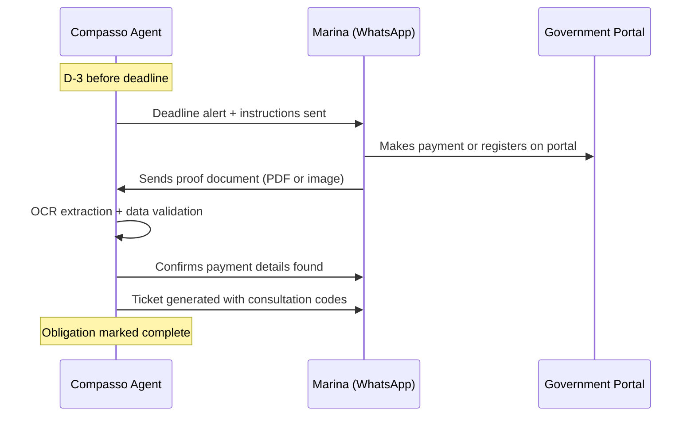

# Agent Interaction Flow

How Compasso's AI agent handles a single obligation from alert to completion.

```mermaid
sequenceDiagram
    participant A as Compasso Agent
    participant M as Marina (WhatsApp)
    participant G as Government Portal

    Note over A: D-3 before deadline
    A->>M: Deadline alert + instructions sent
    M->>G: Makes payment or registers on portal
    M->>A: Sends proof document (PDF or image)
    A->>A: OCR extraction + data validation
    A->>M: Confirms payment details found
    A->>M: Ticket generated with consultation codes
    Note over A: Obligation marked complete
```
