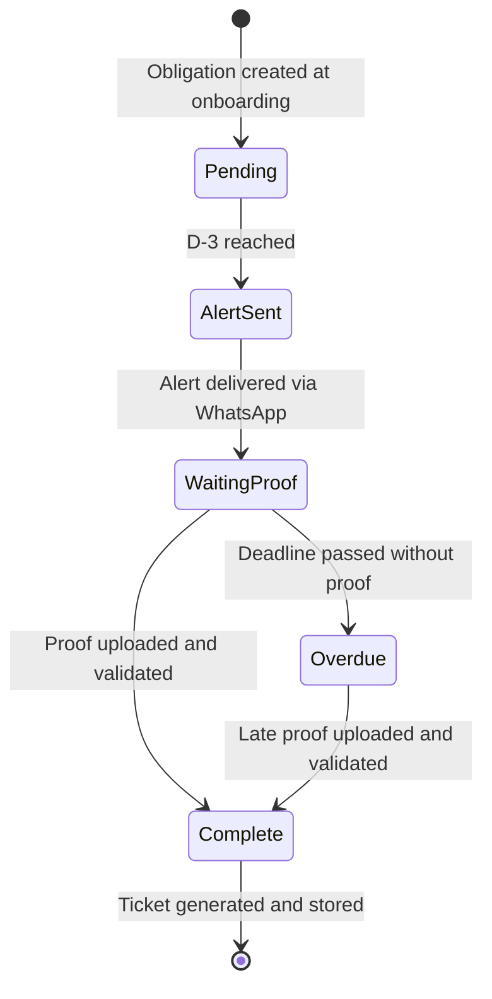

# Obligation Lifecycle

States an obligation moves through inside Compasso.

```mermaid
stateDiagram-v2
    [*] --> Pending: Obligation created at onboarding
    Pending --> AlertSent: D-3 reached
    AlertSent --> WaitingProof: Alert delivered via WhatsApp
    WaitingProof --> Complete: Proof uploaded and validated
    WaitingProof --> Overdue: Deadline passed without proof
    Overdue --> Complete: Late proof uploaded and validated
    Complete --> [*]: Ticket generated and stored
```
