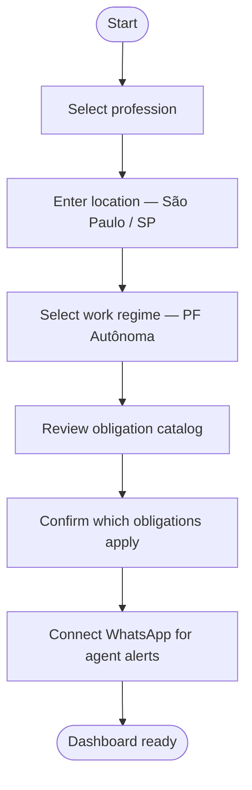

# Onboarding Flow

Seven-step onboarding that configures Marina's obligation profile.

```mermaid
flowchart TD
    A([Start]) --> B[Select profession]
    B --> C[Enter location — São Paulo / SP]
    C --> D[Select work regime — PF Autônoma]
    D --> E[Review obligation catalog]
    E --> F[Confirm which obligations apply]
    F --> G[Connect WhatsApp for agent alerts]
    G --> H([Dashboard ready])
```
